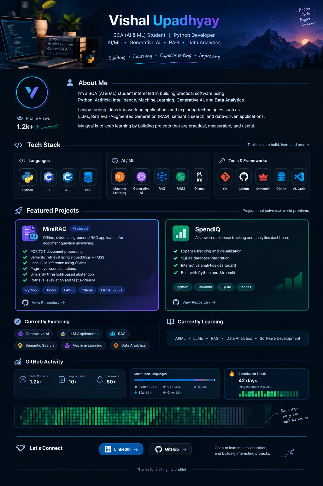

  

  

  

<em>Building • Learning • Experimenting • Improving</em>

---

## 👨‍💻 About Me

I'm a **BCA (AI & ML) student** interested in building practical software using **Python, Artificial Intelligence, Machine Learning, Generative AI, and Data Analytics**.

I enjoy turning ideas into working applications and exploring technologies such as **LLMs, Retrieval-Augmented Generation (RAG), semantic search, and data-driven applications**.

> **Learn by building. Experiment with technology. Turn ideas into working projects.**

---

## 🧠 Tech Stack

### 💻 Languages

### 🤖 AI / ML

### 🧰 Tools & Frameworks

---

## 🚀 Featured Projects

### 🤖 MiniRAG

**Offline • Evidence-Grounded • Retrieval-Augmented Generation**

An offline RAG application for document question answering using semantic retrieval and local LLM inference.

**Highlights**

* 📄 PDF/TXT document processing
* 🔎 Semantic retrieval using embeddings + FAISS
* 🧠 Local LLM inference using Ollama
* 📌 Page-level source citations
* 🚫 Similarity threshold-based abstention
* 📊 Retrieval evaluation and test evidence

**Tech Stack**

`Python` `Tkinter` `FAISS` `Ollama` `Llama 3.2 3B` `all-MiniLM-L6-v2`

 

---

### 💰 SpendiQ

**AI-Powered Expense Tracking & Analytics**

A Python-based expense tracking and analytics dashboard built with Streamlit and SQLite.

**Highlights**

* 📊 Expense tracking and visualization
* 🗄️ SQLite database integration
* 📈 Interactive analytics dashboard
* 🐍 Python-based application

**Tech Stack**

`Python` `Streamlit` `SQLite` `Pandas`

 

---

## 🎯 Currently Exploring

---

## 📚 Currently Learning

**AI/ML**   •  
**LLMs**   •  
**RAG**   •  
**Data Analytics**   •  
**Software Development**

---

## 📊 GitHub Activity

  

---

## 🤝 Let's Connect

 

  

<em>Open to learning, collaboration, and building interesting projects.</em>

---

  

<strong>✨ Thanks for visiting my profile!</strong>

